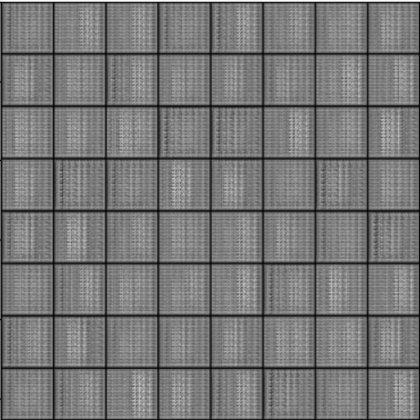
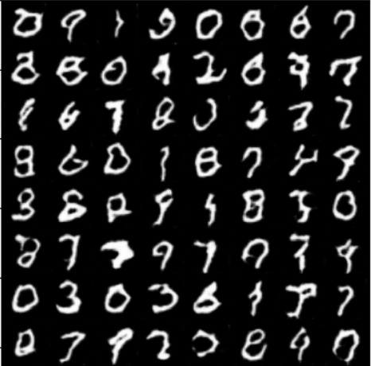
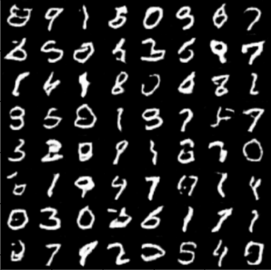
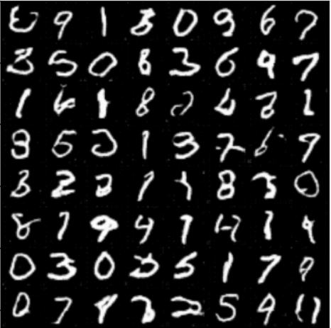
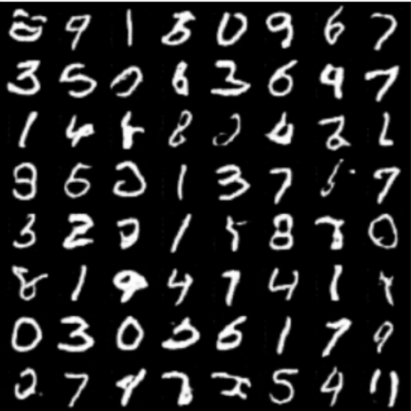

# GAN for MNIST Dataset

This project implements a Generative Adversarial Network (GAN) to generate images similar to those in the MNIST dataset, which consists of handwritten digits. The GAN is trained to create realistic images of digits by learning from a training set of MNIST images.

## Introduction

In this project, we utilize a GAN to generate handwritten digits, achieving results that demonstrate the capability of GANs in producing realistic images.

## Architecture

The GAN architecture consists of two main components:

1. **Generator**: This neural network generates new data instances.
2. **Discriminator**: This neural network evaluates the authenticity of the generated instances.

Both networks are trained simultaneously, competing against each other.

## Training Process

The GAN is trained on the MNIST dataset over a specified number of epochs. During each epoch, the generator produces images, while the discriminator evaluates them. The generator learns to produce better images based on the feedback from the discriminator.

## Results

Below are the generated images at different epochs:

| Epoch | Generated Image |
|-------|------------------|
| 0     |   |
| 5     |   |
| 10    |  |
| 15    |  |
| 20    |  |

